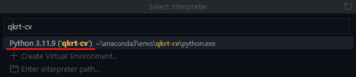

# qkrt-cv

This is a computer vision tool used for generating and training models for applications in the **RoboMaster NA** competitions.<br>

Technologies used:

- Visual Studio Code
- Anaconda3 with Python 3.11.9
- PyTorch
- OpenCV
- ...

## Dependencies

### install Anaconda3<br>

Anaconda3 is a distribution of Python that simplifies package management and deployment, especially for data science and machine learning. It includes the `conda` package manager which facilitates easy creation and management of isolated environments for different projects.

> Download the installer here:<br> > [Anaconda3 v2024.10-1-Windows-x86_64 Installer](https://repo.anaconda.com/archive/Anaconda3-2024.10-1-Windows-x86_64.exe)

Run the installer and follow the prompts leaving everything default.

The rest of the dependencies are automatically installed in the setup instructions.

## Setup Instructions

1. Open a terminal and `cd` into some project directory. Use `git` to clone this repository as shown below:

   ```bash
   git clone https://github.com/qkrt-rm/qkrt-cv.git
   cd qkrt-cv
   ```

2. For <span style="color:gray">Windows 10/11</span> users, open a terminal and execute the setup script `setup.bat` as shown below:

   ```bash
   .\setup.bat
   ```

   The script will configure your terminal to activate the `base` (default) conda environment on startup as well as create a new environment for this project called `qkrt-cv`. This new environment will have all of the necessary `conda` and `pip` packages installed.

3. After the script has finished running, open Visual Studio Code in the root of the repo as shown below:
   ```bash
   code .  # make sure working directory is project-dir/qkrt-cv
   ```
4. Make sure Visual Studio Code is aware of which Python environment it should use. Use the keyboard command `Ctrl+Shft+P` to open the <span style="color:gray">Command Palette</span> and search for `Python: Select Interpreter`.

   Click on or press the `Enter` key while selecting the above option, and then search for the `qkrt-cv` environment that the setup script made.
   <p align="center"></p>

Once you have complete all of the above steps, Visual Studio Code should be able to find all of the modules installed in the environment. You may have to restart Visual Studio Code to see these effects.
